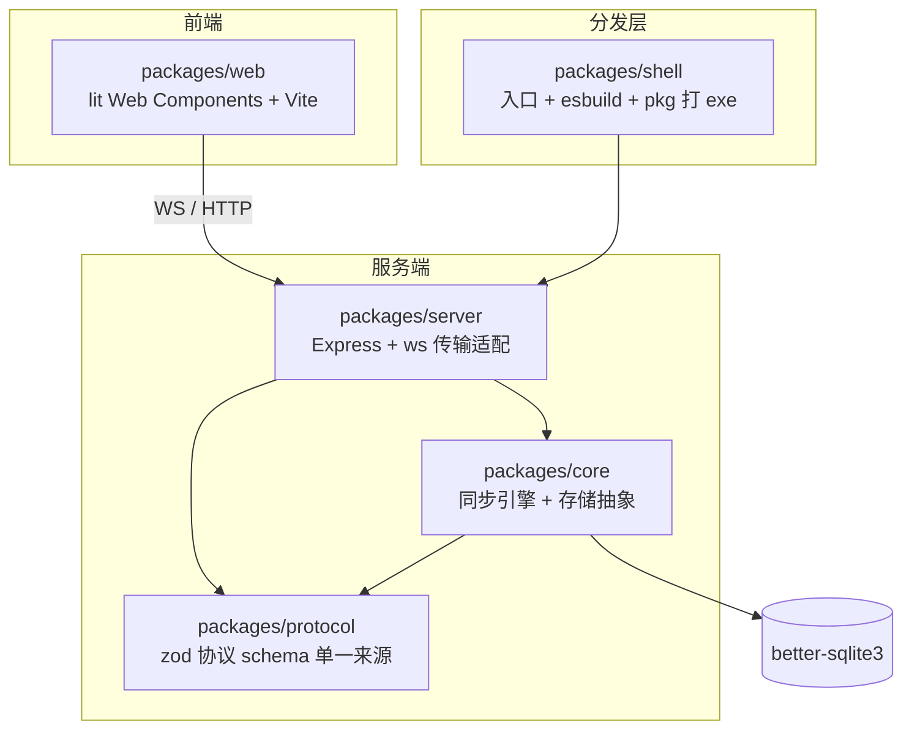
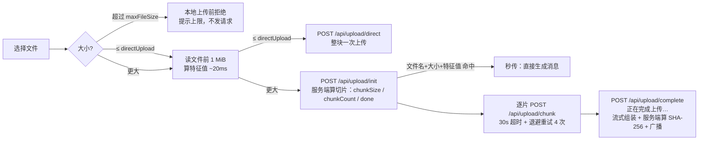

# filesyncEX


> 基于 Node.js 的**局域网文件 / 文字同步工具**。桌面端开一个 exe，局域网内的任意设备（手机 / 电脑）打开网页即可互传文件与消息，无需互联网、无需安装客户端。

| | |
|---|---|
| 版本 | `6.6.0` |
| 语言 / 运行环境 | TypeScript；**开发请用 Node 18**（见[开发环境要求](#开发环境要求重要)），打包产物为 Windows x64 单文件 exe |
| 包管理 | pnpm workspace（5 包 monorepo） |
| 授权 | GPL-2.0-or-later |

---

## 目录

- [功能特性](#功能特性)
- [快速开始](#快速开始)
  - [开发环境要求（重要）](#开发环境要求重要)
- [配置项](#配置项)
- [架构](#架构)
- [运行原理](#运行原理)
  - [启动流程](#启动流程)
  - [消息同步（WebSocket）](#消息同步websocket)
  - [文件上传（HTTP）](#文件上传http)
  - [音频处理](#音频处理)
  - [磁盘卫生与引用计数](#磁盘卫生与引用计数)
- [技术栈与选型理由](#技术栈与选型理由)
- [目录结构](#目录结构)
- [开发](#开发)
  - [常用脚本](#常用脚本)
  - [测试](#测试)
  - [改版本号](#改版本号)
- [打包发布](#打包发布)
  - [Linux 打包说明](#linux-打包说明)
- [安全说明](#安全说明)
- [已知限制](#已知限制)
- [开发笔记](#开发笔记)
- [开源协议](#开源协议)

---

## 功能特性

- **文字 / 代码消息**：WebSocket 实时同步，代码语法高亮，URL 自动转链接
- **文件传输**：图片 / 视频 / 音频 / 任意文件
  - ≤ 直传阈值（默认 8 MiB）：整块一次上传，跳过哈希与分片，几乎无等待
  - 更大的文件：分片上传（**切片按文件大小动态取** 1–8 MiB），支持**断点续传**与**秒传**（文件名 + 大小查重，客户端零哈希成本）
  - 单文件上限默认 **16 GiB**（可配置），超限文件在**上传前**就被拒（不白算哈希、不消耗流量）
- **音频播放**：服务端 WASM 解码为 16-bit PCM WAV 流，浏览器原生播放（支持拖动 seek），频谱图由前端渲染
- **设备身份**：浏览器指纹生成设备 ID，可自定义昵称，按指纹分配彩色头像
- **响应式 UI**：桌面端（拖拽 / 键盘上传）+ 移动端（长按删除 / 触摸优化 / 底部输入条）双端适配，支持亮/暗主题
- **局域网二维码**：一键扫码打开网页；多网卡机器会列出备用地址
- **数据管理**：一键导出全部数据（消息库 + 文件）为 zip，可查询/开关开机自启，可关闭或清空服务器
- **单文件分发**：`release/filesyncex-<版本>.exe`，带应用图标与版本信息，双击即用

---

## 快速开始

```bash
# 安装依赖
pnpm install

# 开发模式（两个终端）
pnpm dev:web      # 前端 Vite 热更新（5173，/api 与 /ws 代理到 4100）
pnpm dev:server   # 服务端（默认 4100，端口被占用自动向后切换）

# 全量构建 / 跑测试 / 打包 exe
pnpm build
pnpm test
pnpm package      # 产物：release/filesyncex-<版本>.exe
```

> 服务端默认端口 `4100`，可在 `serverConfig.json`（进程 cwd）或环境变量 `FSEX_HTTP_PORT` 修改；
> 端口被占用时**自动向后探测空闲端口**并打印实际地址。HTTP 与 WebSocket **复用同一端口**（WS 路径 `/ws`）。

### 开发环境要求（重要）

- **请用 Node 18 开发**（仓库根有 `.nvmrc`：`nvm use`）。`better-sqlite3` 是原生模块，其 `.node` 二进制与 Node 的 ABI 强绑定：
  用更高版本 Node（如 22/25）运行会 `ERR_DLOPEN_FAILED` —— 服务会**直接报错退出并打印修复办法**（不再静默降级内存存储，
  那会让「数据重启即丢」被当成正常现象）。修复：`nvm use 18`，或 `pnpm rebuild better-sqlite3`。
- 确实想用内存存储（数据不持久化）：设 `FSEX_ALLOW_MEMORY_STORE=1`，或 `serverConfig.json` 写 `{"store":"memory"}`。
- pkg 打包目标是 **node18**；用 Node 18 开发/打包可保证运行环境与产物一致（打包脚本会做 ABI 预检）。

---

## 配置项

配置文件 `serverConfig.json` 放在**进程工作目录**（exe 双击启动时会先 chdir 到 exe 所在目录）：

```jsonc
{
  "httpPort": 4100,          // HTTP 端口（WS 复用）；0 = 系统分配；被占用会自动向后探测
  "dataDir": "./data",       // 数据目录（数据库 + 上传文件）
  "uploadDir": "./data/uploads",
  "webDir": "../web/dist",   // 前端静态资源目录（exe 打包时由 shell 注入）
  "historyLimit": 500,       // 消息历史保留条数（超出裁剪；附件不随裁剪删除，见下）

  // ---- 上传限制（都会通过 /api/health 的 limits 下发给客户端）----
  "maxFileSize": 17179869184,   // 单文件上限，默认 16 GiB；0 = 不限制
  "directUpload": 8388608,      // ≤ 该值整块直传，默认 8 MiB（超过 maxFileSize 时自动收敛）
  "chunkSizeMin": 1048576,      // 切片下限，默认 1 MiB
  "chunkSizeMax": 8388608,      // 切片上限，默认 8 MiB（与 min 相同 = 固定切片）

  "store": "sqlite",            // sqlite（默认）| memory（数据不持久化）
  "quiet": false                // 是否静默启动（不打地址 banner）
}
```

**切片大小怎么定**：服务端按文件大小自动取（目标分片数约 4096，取最近的 2 的幂再收敛到上下限），客户端一律按 `init`
返回的 `chunkSize` 切分。默认区间下的抽样：

| 文件大小 | 切片 | 分片数 |
|---|---|---|
| ≤ 4 GiB | 1 MiB | ≤ 4096 |
| 8 GiB | 2 MiB | 4096 |
| 16 GiB | 4 MiB | 4096 |
| ≥ 32 GiB | 8 MiB | ≥ 4096 |

> 旧版配置里的 `chunkSize`（固定切片）会被自动迁移为等值的 `chunkSizeMin`/`chunkSizeMax`，行为不变；
> `directUpload > maxFileSize`、`chunkSizeMin > chunkSizeMax` 都会被自动收敛并打印告警。

其他环境变量：

| 变量 | 作用 |
|---|---|
| `FSEX_HTTP_PORT` | 覆盖 HTTP 端口 |
| `FSEX_ALLOW_MEMORY_STORE=1` | 允许原生模块不可用时降级内存存储 |
| `FSEX_FORCE_BUILD=1` | 打包时强制全量构建（忽略增量跳过） |
| `FSEX_OBFUSCATE=0` | 打包时关闭 esbuild minify 混淆（默认开启） |
| `FSEX_TARGET=linux` | 指定打包目标平台 |

---

## 架构

五包 pnpm monorepo，分层依赖，职责清晰：



| 包 | 职责 |
|---|---|
| `@filesyncex/protocol` | 消息 / 上传 / WS 帧的 **zod schema + TS 类型**（前后端共享的唯一协议来源） |
| `@filesyncex/core` | 纯业务逻辑：同步引擎（SyncEngine）、存储抽象（`Store` 接口：SqliteStore / MemoryStore）、事件总线（EventBus），零框架 |
| `@filesyncex/server` | 传输适配层：Express（HTTP + 分片上传 + 静态资源 + 管理接口鉴权）、ws（WebSocket 广播）、音频解码与转码 |
| `@filesyncex/web` | 前端：lit 组件（`app.ts` + `ui/` 展示层）、Vite 构建，桌面 / 移动端响应式 |
| `@filesyncex/shell` | 可执行入口：启动 banner、esbuild bundle、pkg 打 exe、rcedit 改图标 |

**依赖方向**：`web/server → core → protocol`，`shell → server`。下层不反向依赖上层，保证可替换性（如存储可从 sqlite 切 memory）。

---

## 运行原理

### 启动流程

```
shell main()
  ├─ 打印 FS 3D 字符 logo + 版本 banner
  └─ server.run(config)
      ├─ loadConfig()：读 serverConfig.json + 默认值 + 环境变量（含旧配置迁移/一致性收敛）
      ├─ 单实例锁（dataDir/.instance.lock，崩溃残留自动接管）
      ├─ createStore()：better-sqlite3（默认）或内存存储（ABI 不匹配时直接报错退出）
      ├─ SyncEngine + UploadService（含磁盘卫生 sweeper）
      ├─ 端口探测：被占用则自动切到下一个空闲端口并打印提示
      └─ Express 监听（HTTP + WS 复用同端口 /ws）
```

### 消息同步（WebSocket）

1. 前端打开网页 → 建立 `ws://<host>:<port>/ws`
2. 客户端上报 `hello`（设备身份：指纹 ID / 昵称 / 颜色 / 平台）
3. 服务端回 `welcome`（自身设备 + 历史消息 + 在线设备），随后广播实时帧
4. `send`（文本 / 代码）与 `del`（删除）经服务端校验后广播给所有端；`rename` 改名广播 `renamed` + `peers`
5. 服务端 30s 心跳（ping/pong），失联连接自动清理；前端断线指数退避重连

### 文件上传（HTTP）



- **秒传**：`init` 携带文件名 + 大小 + 前 1 MiB 特征值（客户端只读 1 MiB，无需整文件哈希），服务端命中则直接生成一条新消息（复用同一物理文件）
- **断点续传**：中断时 localStorage 保存 `uploadId`（key = 文件名 + 大小 + 特征值），下次复用会话，跳过已完成分片
- **进度反馈**：0% 提示「正在准备上传…」；分片传完后（服务端组装校验，大文件 1~5 秒）提示「正在完成上传…」并显示旋转弧。
  消息由 WS 广播回来时**原地替换占位卡**（占位卡与真实卡的尺寸/间距严格对齐），全程无空档闪烁
- **完整性与 key**：整文件 SHA-256 由**服务端**在组装分片时流式算出，作为文件 key 与 `sha256` 元数据。
  客户端**不再**计算整文件摘要 —— 浏览器无原生流式 SHA-256（局域网 HTTP 非安全上下文），
  纯 JS 单核仅 ~100 MB/s，500 MB 要 5~7 秒，且这段等待正好显示为「上传进度 0%」（详见 [docs/NOTES.md](docs/NOTES.md) §3.1）
- 下载：`GET /api/file/:key`（引用计数归零自动删除物理文件；下载文件名回退为原始文件名）

接口细节（含管理接口鉴权、`limits` 字段、错误码）见 **[docs/API.md](docs/API.md)**。

### 音频处理

上传后服务端用 `@audio/decode-*`（WASM）解码，对外只暴露一个接口：

| 接口 | 作用 |
|---|---|
| `/api/stream/:key` | 转码为 16-bit PCM WAV 流，支持 `Range`（浏览器可拖动 seek） |

频谱图由前端模拟渲染（无服务端波形接口）。转码结果用 **LRU 缓存（上限 8 个）**，避免大音频常驻内存。

### 磁盘卫生与引用计数

- **引用计数**：文件索引（`files` 表）记录 `refs` 与 `file_refs(key, msg_id)`，一条消息对应一次引用；
  删除消息时引用 -1，**归零才物理删除**（同一文件被多条消息共享时不会误删）。启动时会按 `messages` 表全量重算修正旧库。
- **磁盘清理**（启动时 + 每 6h，`UploadService.sweep()`）：回收超过 24h 未完成的分片会话目录、无会话记录的孤儿目录、
  组装中断的 `.tmp-*`、无人引用的孤儿封面/附件（正在上传或被消息引用的受保护）。
- **历史裁剪不删附件**：超出 `historyLimit` 的旧消息被裁掉后，其物理文件保留，交由上面的清理流程按 TTL 回收。

---

## 技术栈与选型理由

| 库 | 用途 | 选择理由 |
|---|---|---|
| **zod (v4)** | 协议 / 配置 schema 校验 | 一个 schema 同时提供 TS 类型（`z.infer`）与运行时校验，前后端共享单一协议来源，杜绝类型漂移；v4 体积更小、校验更快 |
| **lit** | 前端 Web Components | 轻量、无大框架运行时，原生 Web Components 标准，双端响应式 |
| **Vite** | 前端构建 | 启动 / 构建快，天然适配 ESM 与静态资源 |
| **Express** | HTTP 服务 | 成熟稳定，中间件生态好，路由简洁（分片上传 / 静态资源 / 管理接口） |
| **ws** | WebSocket | 轻量高性能，Node 原生风格，配合 Express 复用同端口 |
| **better-sqlite3** | 本地存储 | 同步 API 无回调地狱、性能好；封装 `Store` 接口便于替换 |
| **@audio/decode-*** | 音频解码 | 纯 JS/WASM 解码 mp3/flac/opus/vorbis/aac，服务端统一转 WAV，浏览器无需装解码器 |
| **qrcode** | 局域网二维码 | 生成访问地址二维码，扫码即连 |
| **esbuild** | 服务端 bundle（+ 可选混淆） | 把 ESM 源码 bundle 成单文件 CJS（pkg 无法对 ESM/import.meta 生成 bytecode）；打包时用 `--minify` 做轻量混淆 |
| **@yao-pkg/pkg** | 打 exe | 把 Node 应用 + 静态资源打成单文件 Windows exe |
| **rcedit** | 修改 exe 资源 | 设置应用图标 / 版本信息（配合自定义 payload 恢复脚本） |
| **tsx** | 开发运行 | 开发模式直接跑 TS，无需预编译 |

---

## 目录结构

```
packages/
  protocol/    # 协议 schema + 类型（zod）
    src/schema.ts
  core/        # 同步引擎 / 存储抽象 / 事件
    src/{SyncEngine,Store,SqliteStore,MemoryStore,EventBus}.ts
  server/      # Express + ws + 上传 + 音频
    src/
      auth.ts        # 管理端点守卫（令牌 + 来源校验）
      config.ts      # 配置 schema + 动态切片算法 + 旧配置迁移
      upload.ts      # 分片/直传/秒传 + 引用登记 + 磁盘卫生清理
      HttpServer.ts / SocketServer.ts / wave.ts / zip.ts / net.ts
      version.ts     # 版本号唯一来源（打包内联 / 开发读 package.json）
    test/            # 测试（自研进程内 runner + Node 断言）
  web/         # lit 前端（Vite）
    src/
      app.ts / app.css   # 主组件（状态 + 生命周期 + 输入/上传/预览交互）
      api.ts             # HTTP 客户端（分片上传、文件特征值、limits 预检）
      fingerprint.ts     # 文件特征值：只读前 1 MiB 算 SHA-256（秒传 / 续传判定）
      auth.ts            # 管理接口令牌（authFetch）
      device.ts / i18n.ts / ws.ts
      ui/                # 展示层：helpers / icons / prism / lang / messages
    public/            # favicon / 字体 / 夜鹭演示页（直接产出到 dist）
  shell/       # 入口 + 打包
    src/index.ts
    scripts/
      bundle.mjs         # esbuild bundle（内联版本号，参数数组调用避免 shell 引号问题）
      package.mjs        # 完整打包流水线
      fix-icon.mjs       # rcedit 改图标后恢复 pkg payload
fonts/         # 前端字体（打包时同步到 web/public）
docs/          # API 文档 / 原型 / 对话与操作记录
scripts/       # set-version.mjs、export-dsh-chat.mjs
release/       # 打包产物（gitignored）
```

---

## 开发

### 常用脚本

| 命令 | 说明 |
|---|---|
| `pnpm install` | 安装依赖 |
| `pnpm dev:web` | 前端开发（Vite 热更新，5173） |
| `pnpm dev:server` | 服务端开发（tsx，4100） |
| `pnpm build` | 全量构建（tsc + vite） |
| `pnpm test` | 构建 + 跑测试 |
| `pnpm start` | 以 Node 运行（非 exe） |
| `pnpm package` | 打包（增量构建，Windows exe / Linux 自动识别） |
| `pnpm package:linux` | 在 Linux 环境打包（强制 node18-linux-x64） |
| `pnpm run set-version <x.y.z>` | 统一改版本号 |

### 测试

```bash
pnpm test                                        # 全部（构建 + 测试）
pnpm --filter @filesyncex/server test security   # 只跑文件名含 security 的用例
```

- 用例在 `packages/server/test/`（当前 **70 条全过**），覆盖：管理端点鉴权（令牌 / 跨站来源 / 导出 zip）、
  **文件引用计数与物理回收**、磁盘卫生清理、sha256 校验、断点续传 / 秒传、**动态切片算法与配置迁移**、版本号唯一来源、多网卡地址探测。
- 运行器是自研的**进程内** runner（`test/run.mjs` + `test/helpers/testkit.mjs`，用法与 vitest 接近：
  `describe / it / before / after / expect`）：不用 `node --test`（会给每个测试文件 spawn 子进程，受限环境直接 EPERM）、
  不用 vitest（依赖 esbuild 子进程加载配置）。依赖 sqlite 的用例在 ABI 不匹配时会**自动跳过并提示**，其余照常运行。
- CI：`.github/workflows/ci.yml`（Node 18 + pnpm 10.15 + `--frozen-lockfile` + 构建 + 测试）。

### 改版本号

```bash
pnpm run set-version 6.6.0     # 例：6.6.0 → 6.6.0pnpm test                      # 可选：版本号唯一来源用例会校验一致性
```

版本号是**单一来源**（根 `package.json`），脚本只改这 7 处：根 + 5 个子包 `package.json` 的 `version`、README 顶部版本行。
其余全部自动跟随，**不需要额外步骤**：`/api/health`、启动 banner、网页控制台版本号、产物名与 exe 版本信息都会跟随；
`pnpm-lock.yaml` 记录的是 `workspace:*` 链接而非版本号，**改完不用重新 install**。

---

## 打包发布

`pnpm package` 完整流程：

1. 增量构建各包（源未变跳过，`FSEX_FORCE_BUILD=1` 强制全量）
2. 同步 `fonts/` 到前端
3. 精简复制 `better-sqlite3`（只留 `.node` + lib，删编译源码）及 `bindings`/`file-uri-to-path`，并**预检原生模块 ABI 与打包目标是否一致**
4. `scripts/bundle.mjs` 用 esbuild 把 shell 入口 bundle 成单文件 CJS，并把根 `package.json` 的版本号内联进去（`--define:__APP_VERSION__`）
5. 默认开启轻量混淆（`esbuild --minify`，后端 bundle + 前端 assets；`FSEX_OBFUSCATE=0` 关闭）
6. `pkg` 打包（`--compress GZip` 压缩包体）；打包前自动停止 `release/` 下正在运行的旧版进程
7. `fix-icon.mjs`：rcedit 设置图标 + 版本信息，并从原 exe 提取恢复 pkg payload（仅 Windows）

**产物**：

- Windows：`release/filesyncex-<版本>.exe`（约 71 MB），双击即用
- Linux：`release/filesyncex-<版本>-linux-x64`（ELF，无 `.exe` 后缀）

### Linux 打包说明

- 在 Linux 机器 / 容器里执行 `pnpm package:linux`（或 `pnpm package`，脚本按 `process.platform` 自动选择 `node18-linux-x64`）。
- **better-sqlite3 是原生模块**：必须在 Linux 环境 `pnpm install`（编译出 Linux 的 `.node`）后再打包，Windows 上无法交叉产出可用的 Linux 模块。
- Linux 产物为 ELF 二进制：跳过 rcedit / 图标修补；杀旧进程改用 `pkill -f`。
- 开机自启接口基于 Windows 注册表（`reg`），在 Linux 上返回「当前平台不支持」（501）；其余功能（上传 / 同步 / 导出 / 下载 / 关闭 / 重置）跨平台一致。

---

## 安全说明

- **本机管理接口已加令牌 + 来源校验**：`/api/sys/*`（关闭 / 清空数据 / 开机自启）、`/api/data/export`（导出全部聊天记录）、
  `/api/app/download`（下载服务器本体）需要 `X-FSEX-Token`（由 `GET /api/auth` 同源下发，每次启动随机生成），
  并拒绝带外部 `Origin` / `Sec-Fetch-Site: cross-site` 的浏览器请求 —— 防止局域网内任意网页跨站关服或清库。
- **业务面仍然无鉴权**（上传 / 下载 / 消息 / 删除均开放，设计如此）：同网段任何人都能收发、下载、删除消息。
  **不要把服务暴露到公网**（无 TLS、无账号体系）。

---

## 已知限制

- **Node 版本敏感**：原生模块 `better-sqlite3` 的 ABI 与 Node 版本绑定，Node ≥ 22 且未 rebuild 时服务会**拒绝启动**（见[开发环境要求](#开发环境要求重要)）。
- **秒传判定键含「前 1 MiB 特征值」**：整文件 SHA-256 在浏览器里太慢（详见 [docs/NOTES.md](docs/NOTES.md) §3.1），
  因此客户端只读前 1 MiB 算特征值参与判定。代价是**首 1 MiB 相同、仅其后内容不同**的两个同名同大小文件会被判为同一文件
  （直接复用已有物理文件）；整文件 SHA-256 仍由服务端算出并作为文件 key 与 `sha256` 元数据，服务端侧不存在内容错乱。
- **音频转码内存**：转码缓存已用 LRU（上限 8 个）限制，但单文件解码过程仍会一次性占用该文件大小的内存（解码出的 WAV Buffer）。
- **思源宋体约 6 MB**：`SourceHanSerifCN-Medium.woff2` 是单个体积最大的资源（可子集化或换字体优化）。
- **pkg 首次打包需联网**：需从 pkg-cache 下载 Node 基础二进制（约 40 MB），离线环境首次打包会失败。
- **打包链路对 pkg 内部结构敏感**：`fix-icon.mjs` 依赖 pkg 的 payload 占位符布局，升级 `@yao-pkg/pkg` 后需回归验证；
  `@yao-pkg/pkg` 上游已停止维护、目标为已 EOL 的 node18，中期建议评估 Bun compile 或 Node 22 SEA 替代 ——
  **Bun compile 已实测过（Bun 1.4.2）**，结论与数据见 [docs/NOTES.md 第四节](docs/NOTES.md)：功能全通（含 `bun:sqlite` 顶替），
  但产物更大（93.6 MB 且静态资源需外置，总计 99.9 MB vs 71.2 MB）、冷启动无优势、exe 图标与版本信息需另接资源编辑器，故**暂时不迁**。
- **压缩 payload 的启动开销**：GZip 压缩换取体积，运行时首次解压使启动略慢（局域网场景可接受）。
- **历史限制**：消息历史默认只保留 500 条（`historyLimit`），更早的消息会被裁掉（其附件仍留在磁盘上，由清理流程回收）。

---

## 开发笔记

深度细节（踩坑记录、性能实测、设计取舍）按主题归档，避免 README 膨胀：

| 文档 | 内容 |
|---|---|
| **[docs/NOTES.md](docs/NOTES.md)** | 开发笔记：踩过的坑（打包/浏览器/依赖共 15 条）、做过的优化与**实测基准数据**、设计取舍备忘、**Bun compile vs pkg 实测对比** |
| **[PROJECT_LOG.md](PROJECT_LOG.md)** | 项目操作日志：每次改动的动机、实现与验证（时间线） |
| **[docs/API.md](docs/API.md)** | HTTP API 技术文档（端点、协议、鉴权、错误码） |
| **[docs/CHAT_HISTORY.md](docs/CHAT_HISTORY.md)** | 开发对话记录 |

维护时最容易踩的几个点，先看这里：

1. **改前端（CSS/TS）后必须重新构建再验证** —— 否则验的是旧产物（本项目真实踩过一次，得出过错误结论）。
2. **`--define` 之类的参数不要拼 shell 命令行** —— 引号会被 shell 吃掉；用参数数组调用（见 `packages/shell/scripts/bundle.mjs`）。
3. **切片大小是服务端权威**：客户端一律按 `init` 返回的 `chunkSize` 切分，不要自己算。
4. **交付前跑 `pnpm test`**；改动上传/回收相关逻辑时，`packages/server/test/` 里已有对应回归用例。

---

## 开源协议

本项目采用 **GNU General Public License v2.0-or-later**（SPDX: `GPL-2.0-or-later`）授权。

[](LICENSE.md)

- 你可以自由使用、复制、修改、再分发本项目；但**修改后的衍生作品必须以相同协议开源**。
- 内嵌的音频解码器 `@audio/decode-aac`（GPL-2.0）与本协议完全兼容。
- 完整条款见 [LICENSE.md](LICENSE.md)。

Copyright (C) 2026 NoRainLand
