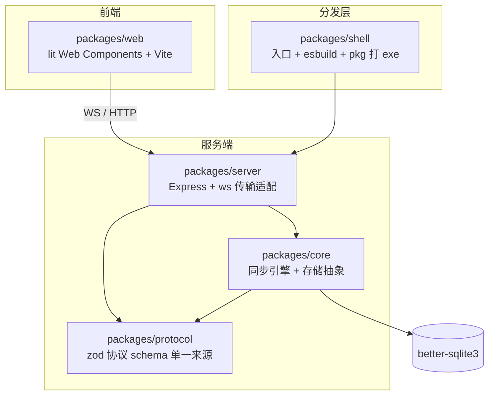

# filesyncEX

> 基于 Node.js 的**局域网文件 / 文字同步工具**。桌面端开一个 exe，局域网内的任意设备（手机 / 电脑）打开网页即可互传文件与消息，无需互联网、无需安装客户端。

- 版本：`6.0.0-beta1`
- 语言 / 运行环境：TypeScript（Node ≥ 18，打包产物为 Windows x64 单文件 exe）
- 包管理器：pnpm workspace（monorepo）

---

## 目录

- [功能特性](#功能特性)
- [快速开始](#快速开始)
- [架构](#架构)
- [运行原理](#运行原理)
- [技术栈与选型理由](#技术栈与选型理由)
- [目录结构](#目录结构)
- [打包发布](#打包发布)
- [做过的优化尝试](#做过的优化尝试)
- [踩过的坑](#踩过的坑)
- [可能存在的问题 / 已知限制](#可能存在的问题--已知限制)
- [常用脚本](#常用脚本)
- [开源协议](#开源协议)

---

## 功能特性

- **文字 / 代码消息**：实时同步，代码高亮，URL 自动链接
- **文件传输**：图片 / 视频 / 音频 / 任意文件
  - 小文件（≤ 8MB）直接上传，秒传完成
  - 大文件分片上传（1 MiB/片），**断点续传** + **秒传**（SHA-256 查重）
- **音频播放**：服务端解码为 16-bit PCM（WAV 流），浏览器原生播放（支持拖动 seek），频谱图由前端渲染
- **设备身份**：浏览器指纹生成设备 ID，自定义昵称，彩色头像
- **响应式 UI**：桌面端（键盘 / 拖拽上传）+ 移动端（长按删除 / 触控优化）双端适配
- **局域网二维码**：一键扫码打开网页
- **单文件分发**：`release/filesyncex.exe`，带应用图标与版本信息，双击即用

---

## 快速开始

```bash
# 安装依赖（如遇 npm 镜像 502，可临时换源）
pnpm install

# 开发模式（两个终端）
pnpm dev:web      # 前端 Vite 热更新
pnpm dev:server   # 服务端（默认 4100，端口被占用自动切换）

# 全量构建
pnpm build

# 打包 exe（输出到 release/filesyncex.exe）
pnpm package
```

> 服务端默认端口 `4100`，可在 `serverConfig.json`（进程 cwd）或环境变量 `FSEX_HTTP_PORT` 修改；端口被占用时**自动向后探测空闲端口**并打印提示。

---

## 架构

五包 pnpm monorepo，分层依赖，职责清晰：



| 包 | 职责 |
|---|---|
| `@filesyncex/protocol` | 消息 / 上传 / WS 帧的 **zod schema + TS 类型**（前后端共享的唯一协议来源） |
| `@filesyncex/core` | 纯业务逻辑：同步引擎（SyncEngine）、存储抽象（`Store` 接口：SqliteStore / MemoryStore）、事件总线（EventBus），零框架 |
| `@filesyncex/server` | 传输适配层：Express（HTTP + 分片上传 + 静态资源）、ws（WebSocket 广播）、音频解码与转码 |
| `@filesyncex/web` | 前端：lit 单组件 + Vite 构建，桌面 / 移动端响应式 |
| `@filesyncex/shell` | 可执行入口：启动 banner、esbuild bundle、pkg 打 exe、rcedit 改图标 |

**依赖方向**：`web/server → core → protocol`，`shell → server`。下层不反向依赖上层，保证可替换性（如存储可从 sqlite 切 memory）。

---

## 运行原理

### 启动流程

```
shell main()
  ├─ 打印 FS 3D 字符 logo + 版本 banner
  └─ server.run(config)
      ├─ loadConfig()：读 serverConfig.json + 默认值 + 环境变量
      ├─ 单实例锁（dataDir/.instance.lock，崩溃残留自动接管）
      ├─ createStore()：better-sqlite3（默认）或内存存储
      ├─ SyncEngine + UploadService + 音频服务
      ├─ 端口探测：被占用则自动切到下一个空闲端口并打印提示
      └─ Express 监听（HTTP + WS 复用同端口 /ws）
```

### 消息同步（WebSocket）

1. 前端打开网页 → 建立 `ws://<host>:<port>/ws`
2. 客户端上报 `hello`（设备身份：指纹 ID / 昵称 / 颜色 / 平台）
3. 服务端广播历史 `ADD/FULL` + 后续实时帧
4. `send`（文本 / 代码）与 `del`（删除）经服务端校验后广播给所有端

### 文件上传（HTTP）


- **秒传**：`init` 携带 sha256，服务端查重命中则直接生成消息
- **断点续传**：中断时 localStorage 保存 `uploadId`，下次同 sha 复用会话，跳过已完成分片
- 下载：`GET /api/file/:key`（引用计数归零自动删除物理文件）

### 音频处理

上传后服务端用 `@audio/decode-*` 解码，提供两个接口：

| 接口 | 作用 |
|---|---|
| `/api/stream/:key` | 转码为 16-bit PCM WAV 流，支持 `Range`（拖动 seek） |

服务端用 WASM 解码器把音频转成 WAV 流，频谱图由前端模拟渲染（无服务端波形接口）。转码结果用 **LRU 缓存（上限 8 个）**，避免大音频常驻内存。

---

## 技术栈与选型理由

| 库 | 用途 | 选择理由 |
|---|---|---|
| **zod (v4)** | 协议 / 配置 schema 校验 | 一个 schema 同时提供 TS 类型（`z.infer`）与运行时校验，前后端共享单一协议来源，杜绝类型漂移；v4 体积更小、校验更快 |
| **lit** | 前端 Web Components | 轻量、无大框架运行时，原生 Web Components 标准，双端响应式 |
| **Vite** | 前端构建 | 启动 / 构建快，天然适配 ESM 与静态资源 |
| **Express** | HTTP 服务 | 成熟稳定，中间件生态好，路由简洁（分片上传 / 静态资源） |
| **ws** | WebSocket | 轻量高性能，Node 原生风格，配合 Express 复用同端口 |
| **better-sqlite3** | 本地存储 | 同步 API 无回调地狱、性能好；封装 `Store` 接口便于替换 |
| **@audio/decode-*** | 音频解码 | 纯 JS 解码 mp3/flac/opus/vorbis/aac，服务端统一转 WAV + 波形，浏览器无需装解码器 |
| **qrcode** | 局域网二维码 | 生成访问地址二维码，扫码即连 |
| **esbuild** | 服务端打包 | 把 ESM 源码 bundle 成单文件 CJS（pkg 无法对 ESM/import.meta 生成 bytecode） |
| **@yao-pkg/pkg** | 打 exe | 把 Node 应用 + 静态资源打成单文件 Windows exe |
| **rcedit** | 修改 exe 资源 | 设置应用图标 / 版本信息（配合自定义 payload 恢复脚本） |
| **tsx** | 开发运行 | 开发模式直接跑 TS，无需预编译 |

---

## 目录结构

```
packages/
  protocol/    # 协议 schema + 类型（zod）
  core/        # 同步引擎 / 存储抽象 / 事件
  server/      # Express + ws + 上传 + 音频
  web/         # lit 前端（Vite）
    src/
      app.ts / app.css   # 主组件与样式
      api.ts             # HTTP/WS 客户端（含分片上传、SHA-256）
      net/ view/ utils/  # 网络 / 视图 / 工具
  shell/       # 入口 + 打包
    scripts/
      package.mjs        # 完整打包流水线
      fix-icon.mjs       # rcedit 改图标后恢复 pkg payload
tool/          # 附加工具（随包分发，如 QuickSendTool.exe）
fonts/         # 前端字体（随 web 打包进 exe）
release/       # 打包产物（filesyncex.exe）
```

---

## 打包发布

`pnpm package` 完整流程：

1. 增量构建各包（源未变跳过，`FSEX_FORCE_BUILD=1` 强制全量）
2. 同步 `tool/`、`fonts/` 到前端
3. 精简复制 `better-sqlite3`（只留 `.node` + lib，删编译源码）及 `bindings`/`file-uri-to-path`
4. `esbuild` 把 shell 入口 bundle 成单文件 CJS
5. `pkg` 打包（`node18-win-x64`，`--compress GZip` 压缩包体）
6. `fix-icon.mjs`：rcedit 设置图标 + 版本信息，并从原 exe 提取恢复 pkg payload

**产物**：`release/filesyncex.exe`（约 74 MB），双击即用。

---

## 做过的优化尝试

| 优化 | 结果 |
|---|---|
| **pkg `--compress GZip`** | exe 体积 106.9MB → **74.3MB（-30.5%）**；已验证与图标修补兼容 |
| **better-sqlite3 精简** | 删掉 sqlite C 编译源码（deps 9.5MB）→ 打包数据 12.96MB → **1.67MB** |
| **增量构建** | 重复打包 46.5s → **38.1s**（未变包跳过构建） |
| **端口自动切换** | 默认端口被占自动向后探测空闲端口并打印提示（最多 20 个） |
| **大文件上传可靠性** | 分片 4 次重试 + 30s 超时 + 服务端 keep-alive 调大，解决 WiFi 中途断连 |
| **移动端 UI** | 频谱图指示条化、长按删除（描边 / 浮起 / 遮罩）、header 压缩、toast 实底等 |
| **音频转码 LRU 缓存** | streamCache 上限 8 个，防止大音频常驻内存 |
| **异步文件 IO** | 分片写盘 / 音频解码 / 分片流式组装（边读边写 + 流式 SHA）改异步，大文件不阻塞事件循环、不整块入内存 |
| **zod v3 → v4** | 协议校验库升级 v4（更小更快）；并为 protocol/core/server 显式声明 typescript 依赖，统一 TS 版本 |
| **死代码清理** | 删除 /api/wave 链路（前端已改模拟频谱）、未使用的 API / 常量 / 导出 / 依赖 |

---

## 踩过的坑

> 记录开发 / 打包过程中最有价值的几个坑，供后续维护参考。

1. **better-sqlite3 打包进 exe 报 `Invalid host defined options`**
   根因是 server 用动态 `import("better-sqlite3")`，pkg 的 V8 快照环境下 ModuleWrap 校验失败（`module_wrap.cc:604`）。**改为静态 `import Database from "better-sqlite3"`**（esbuild `--external` 转 require，走 CJS）后解决。

2. **打包后 `Cannot find module 'bindings'` / `'file-uri-to-path'`**
   better-sqlite3 运行时依赖 `bindings` 查找 `.node` 文件，但其自身依赖链未打进 exe。需把 `bindings` + `file-uri-to-path` 一并作为 pkg assets 复制。

3. **`fs.cpSync` 带 filter 时整目录被 SKIP（复制后目录不存在）**
   Windows 下 cpSync 会把路径转成 `\\?\` 长路径前缀，导致 `path.relative(src, s)` 匹配失败、根目录被 filter 跳过且**偶发**。规避：先整目录复制，再删除不需要的子目录（deps/src/node_modules），并校验 `.node` 存在。

4. **rcedit 改图标会破坏 pkg payload（94MB → 42MB，报 `Pkg: Error reading from file`）**
   pkg 把快照数据追加在 exe 中间，rcedit 重写 PE 会丢弃。且修补 pkg 缓存基础 exe 会被完整性校验覆盖。最终方案：`fix-icon.mjs` 解析 exe 内 `PAYLOAD_POSITION/PRELUDE_POSITION` 占位符 → 提取 payload+prelude → rcedit → 更新占位符 → 拼回。

5. **pkg `--no-bytecode` 报 `no source breaks final executable`**
   pkg 5.16.1 的 bug：入口被标记为 bytecode（STORE_BLOB）且无源码副本。`--public` 可绕过但体积更大（81MB > 76.6MB），最终选择 `--compress GZip` 不动 bytecode。

6. **esbuild 把中文字符转成 `\uXXXX`**
   打包后 exe 里搜中文提示搜不到，误以为代码没打进。诊断时应用 ASCII 标识符（如函数名 `findFreePort`）搜索。

7. **局域网 HTTP 非安全上下文没有 `crypto.subtle`**
   秒传 / 断点续传需要 SHA-256，但 `http://192.168.x.x` 下 Web Crypto 不可用，故用**纯 JS 增量 SHA-256**（`IncrementalSha256`）。代价：大文件上传前哈希计算耗时（这也是引入 8MB 直接上传阈值的原因）。

8. **npm 镜像 502 / 本地代理卡死**
   用户环境 npmmirror 502 + 代理未启动导致 `pnpm install` 卡住。绕过：临时 `npm_config_registry=https://registry.npmjs.org` 并清空 proxy。

---

## 可能存在的问题 / 已知限制

- **无鉴权**：局域网完全开放（设计如此），不建议暴露到公网。
- **思源宋体 6MB**：`SourceHanSerifCN-Medium.woff2` 是单个体积最大的资源（可子集化或换字体优化）。
- **QuickSendTool.exe 2.19MB**：内置在 web/dist 随包分发，可从包里移除改为外部下载。
- **大文件上传前等待**：>8MB 需先算整文件 SHA-256（纯 JS），大文件在真正开始上传前有明显等待。
- **音频转码内存**：转码缓存已用 LRU（上限 8 个）限制；但单文件解码过程仍会一次性占用该文件大小的内存（解码出的 WAV Buffer）。
- **pkg 首次打包需联网**：需从 pkg-cache 下载 Node 基础二进制（fetched，约 40MB），离线环境首次打包会失败。
- **打包链路对 pkg 内部结构敏感**：`fix-icon.mjs` 依赖 pkg 的 payload 占位符布局，升级 `@yao-pkg/pkg` 版本后需回归验证。
- **压缩 payload 的启动开销**：GZip 压缩换取体积，运行时首次解压使启动略慢（局域网场景可接受）。

---

## 常用脚本

| 命令 | 说明 |
|---|---|
| `pnpm install` | 安装依赖 |
| `pnpm dev:web` | 前端开发（Vite 热更新） |
| `pnpm dev:server` | 服务端开发（tsx） |
| `pnpm build` | 全量构建 |
| `pnpm start` | 以 Node 运行（非 exe） |
| `pnpm package` | 打包 exe（增量构建，约 40s） |
| `FSEX_FORCE_BUILD=1 pnpm package` | 强制全量构建后打包 |

---

## 开源协议

本项目采用 **GNU General Public License v2.0-or-later**（SPDX: `GPL-2.0-or-later`）授权。

[](LICENSE.md)

- 你可以自由使用、复制、修改、再分发本项目；但**修改后的衍生作品必须以相同协议开源**。
- 内嵌的音频解码器 `@audio/decode-aac`（GPL-2.0）与本协议完全兼容。
- 完整条款见 [LICENSE.md](LICENSE.md)。

Copyright (C) 2026 NoRainLand
